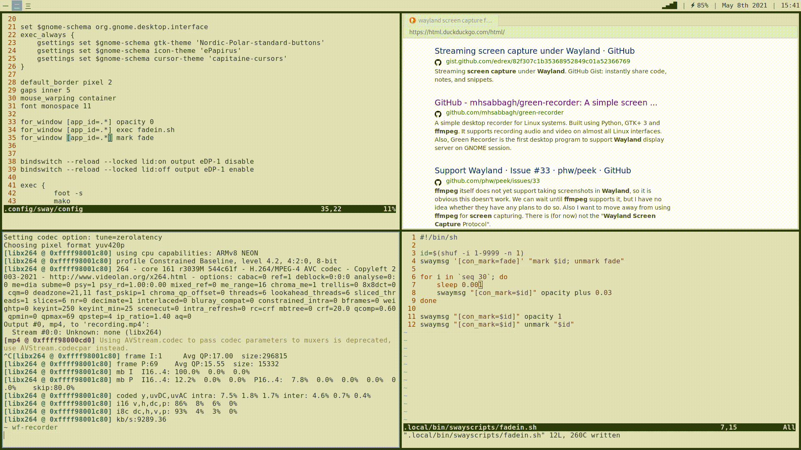

# fade
Have new windows fade in gradually.
This script is alpha (get it;)) at best, you may encounter issues.

## Usage
Add the lines from`sway.config` to your sway config file or `include` them and have `fadein.sh in you `PATH`

## Example

