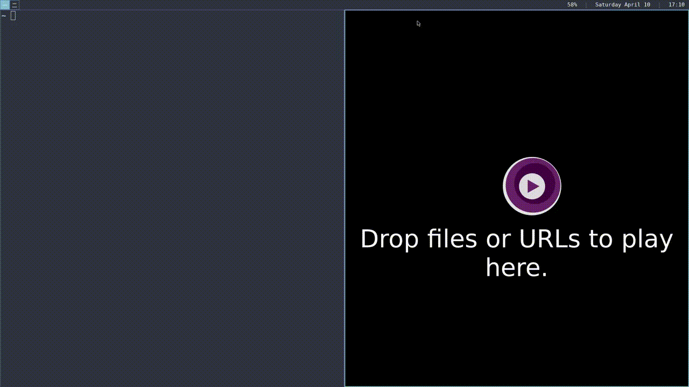

# fullscreenbarworker
When an application goes into full screen, the bar mode will change to `hide`, allowing the user to still see the bar when the appropriate key is pressed. Usually this is the standard Mod key.
The fullscreen is existed, the bar mode will switch back.

## Usage
With fullscreenbarworker.sh in you PATH, modify `.config/sway/config` to include
```
exec swayfullscreenbarworker.sh
```
## Example

